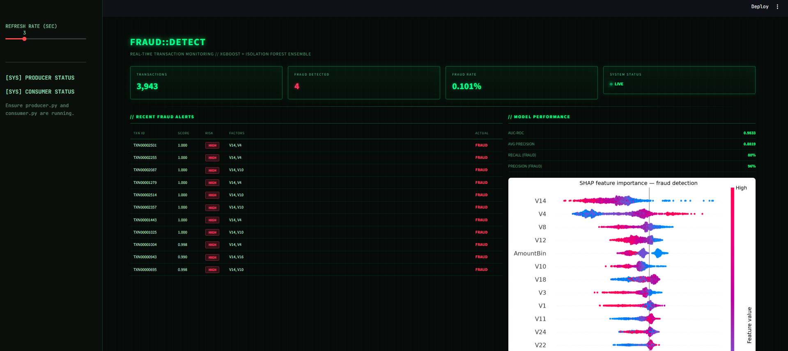
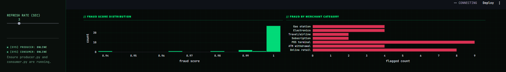

# Real-time Fraud Detection System

> Streaming ML pipeline detecting credit card fraud in real time
> XGBoost + Isolation Forest ensemble | AUC-ROC 0.9833 | Live dashboard



---

## Business problem

Credit card fraud costs billions annually, and most fraud detection
systems operate in batch, catching fraud hours or days after it
happens. This project builds a real-time streaming system that
scores every transaction the instant it occurs, with a live
operations dashboard for monitoring.

---

## Results

| Model | Metric | Score |
|-------|--------|-------|
| XGBoost | AUC-ROC | **0.9833** |
| XGBoost | Avg Precision | 0.8819 |
| XGBoost | Recall (fraud) | 80% |
| XGBoost | Precision (fraud) | 96% |
| Isolation Forest | AUC-ROC | 0.9491 (unsupervised) |

Dataset: 284,807 transactions, 492 fraud (0.17% fraud rate) —
extreme class imbalance handled with SMOTE oversampling.

---

## Key EDA findings

- Fraud transactions average $122 vs $88 for legit — higher value,
  contrary to common assumption
- Top SHAP features: V14, V4, V12, V10, V17 (PCA-transformed signals)
- 154 of 492 frauds (31%) occur at night (10pm-5am)

---

## Live system



The Streamlit dashboard shows: live transaction throughput,
threat level indicator, scrolling alert ticker, fraud score
distribution, and merchant category breakdown — all updating
in real time from the Redis stream.

---

## Architecture

```
Transaction producer (50 tx/sec)
  -> Redis queue (txn:queue)
  -> Consumer worker
       -> XGBoost + Isolation Forest ensemble scoring
       -> SHAP explanation for flagged transactions
       -> Redis alerts store
  -> FastAPI (/predict, /metrics, /alerts)
  -> Streamlit live dashboard
```

All 5 services containerized with Docker Compose —
one command deploys the entire system.

---

## Tech stack

Python | XGBoost | Isolation Forest | SHAP | SMOTE
Redis | FastAPI | Streamlit | Plotly | Docker Compose | MLflow

---

## Quick start

```bash
git clone https://github.com/Efrrowini/fraud-detection
cd fraud-detection
docker-compose up --build
```

API docs: http://localhost:8000/docs
Dashboard: http://localhost:8501

---

## Manual setup (without Docker)

```bash
python -m venv venv
venv\Scripts\activate
pip install -r requirements.txt

python -m src.features
python -m src.train
python -m src.anomaly

# In separate terminals:
python streaming/producer.py
python streaming/consumer.py
streamlit run app/dashboard.py
```

---

## Dataset

Kaggle Credit Card Fraud Detection — 284,807 European cardholder
transactions, September 2013. Features are PCA-transformed for
privacy (V1-V28) plus Time and Amount.
[Source](https://www.kaggle.com/datasets/mlg-ulb/creditcardfraud)

---

*Built by Efro | Presidency University Bangalore | Data Science Portfolio*